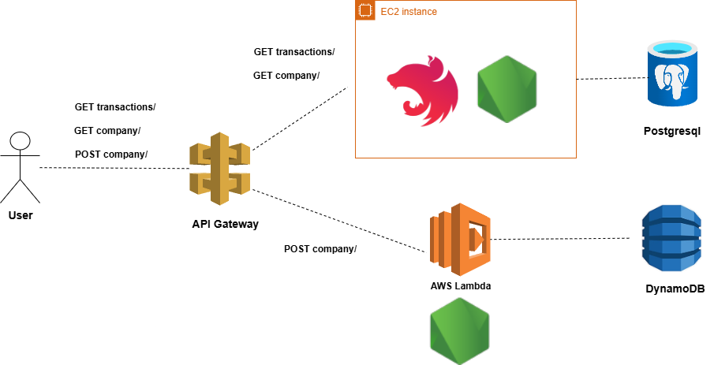

<p align="center">
  <a href="http://nestjs.com/" target="blank"></a>
    <a href="https://www.serverless.com/" target="blank"></a>
</p>

  <p align="center">Bank Monorepo</p>

## Description

Proyecto monorepo que contiene dos proyectos para gestionar información sobre empresas y sus transferencias:

- Web API escrita en NodeJs + NestJs
  1. Obtener las empresas que realizaron transferencias en el último mes.
  2. Obtener las empresas que se adhirieron en el último mes.
  3. Registrar la adhesión de una nueva empresa.
     Estas empresas pueden ser de dos tipos:
     - Empresa Pyme.
     - Empresa Corporativa.

- Lambda Function de AWS que recibe una solicitud de adhesión de empresa (como en el punto 3), valide los datos y los almacena

### Estructura del proyecto

```
BANK-MONOREPO/
├── api-nest
│   ├── src
│   │   ├── config                  # Variables de entorno
│   │   ├── infra
│   │   │   ├── db                  # Configuración DB
│   │   │   └── http-api            # Configuración Nest
│   ├── test                        # Test de integración
├── core
│   ├── src
│   │   ├── application             # Casos de uso
│   │   │   ├── commands
│   │   │   └── use-cases
│   │   ├── common                  # Utilidades y constantes
│   │   │   ├── constants.ts
│   │   │   └── utils
│   │   ├── domain                  # Lógica de negocio pura
│   │   │   ├── entities            # Entidades del dominio
│   │   │   └── ports               # Interfaces de repositorios
├── lambda-serverless
│   ├── src
│   │   └── infra
│   │       ├── db                  # Configuración DB
│   │       └── http-api            # Configuración handler request

```

El proyecto esta diseñado en base a la arquitectura hexagonal, para cumplir con todos los puntos se diseñaron tres modulos:

- core, que contiene el dominio y cu
- api-nest, API rest que cumple con los primeros puntos
- lambda-serverless, que cumple con el último punto

tanto api-nest como lambda-serverless, usan el mismo core de negocio como una librería interna. De esta forma el core no depende de NestJS ni de AWS Lambda, y tanto la api como la función lambda pueden usar el core adaptandolo.



En ese escenario, el despliegue se hace por separado:

- api-nest: Se construye su propia imagen o build con Docker y consume el core como dependencia. Se despliega en un EC2.

- lambda-serverless: Tiene su propio build, mucho más liviano y se empaqueta solo lo necesario para ejecutarse como función (handler, core y adaptadores).

### API-REST

La documentación expandida de la api-nest puede encontrarse [aquí](./api-nest/README.md)

### LAMBDA-SERVERLESS

La función lambda se desarrollo usando serverless con un template de express-dynamodb, al que se le hizo modificaciones para cumplir con la arquitectura hexagonal, para el desarrollo local se utiliza una base de datos node-json-db
La documentación expandida de la función lambda puede encontrarse [aquí](./lambda-serverless/README.md)

## Usage

```
  npm run build:core        # build core
  npm run build:api         # build api-nest
  npm run test:api          # correr test api
  npm run test:core         # correr test core
  npm run test:cov:core     # correr test de covertura core
  npm run lambda            # ejecutar la función lambda
  npm run api               # ejecutar la api
```

**_tanto la api como la función lambda tienen más scripts, conviene revisar cada package.json_**
